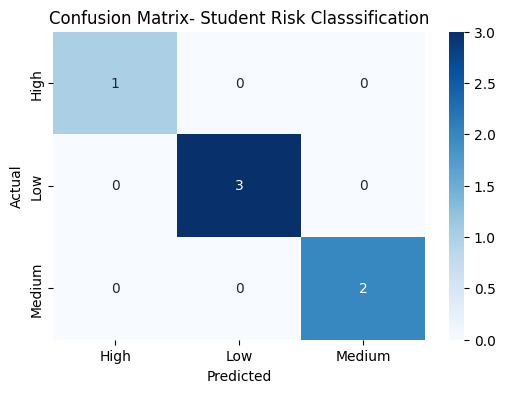
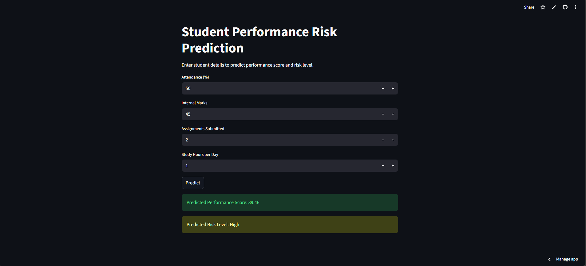

# Student Performance Risk Prediction using Machine Learning
## Live Demo

The application is deployed using Streamlit Cloud and can be accessed here:

🔗 https://student-performance-risk-ml-geraldine.streamlit.app/

---

This project implements an end-to-end machine learning pipeline to analyze student academic data and predict both performance scores and risk levels.  
It combines regression and classification techniques to help identify students who may require academic support at an early stage.

---

## Problem Statement

Educational institutions often struggle to identify students at risk of poor academic performance before it is too late.  
This project aims to:

- Predict a student's performance score using regression  
- Classify students into risk levels (Low / Medium / High)  
- Provide insights that can assist early intervention and academic planning  

---

## Dataset Description

The dataset contains academic and behavioral features related to student performance.

### Input Features
- Attendance (%)
- Internal Marks
- Assignments Submitted
- Study Hours per Day

### Target Variables
- Performance Score (Regression)
- Risk Level: Low / Medium / High (Classification)

### Files Used
- `student_performance.csv` – Raw dataset  
- `student_performance_with_risk.csv` – Dataset with derived risk labels  

---

## Machine Learning Approach

### Regression Model
- Algorithm: Linear Regression  
- Purpose: Predict the final performance score of a student  

### Classification Model
- Algorithm: Logistic Regression  
- Purpose: Classify students into risk categories  
- Label Encoding: Converts categorical risk levels into numerical values  

---

## Model Evaluation

The classification model is evaluated using:

- Accuracy Score  
- Confusion Matrix  

The confusion matrix helps visualize correct and incorrect predictions for each risk category.

---

## Results and Visualization

### Confusion Matrix – Student Risk Classification



The confusion matrix indicates that the model correctly classified all samples in the evaluation dataset.

### Application Interface



---

## Project Structure

```text
student-performance-risk/
│
├── app.py
│
├── assets/
│   └── confusion_matrix.png
│
├── data/
│   ├── student_performance.csv
│   └── student_performance_with_risk.csv
│
├── model/
│   ├── score_model.pkl
│   ├── risk_model.pkl
│   └── risk_label_encoder.pkl
│
├── src/
│   ├── create_risk_labels.py
│   ├── train_regression.py
│   ├── train_classifier.py
│   └── utils.py
│
├── .gitignore
├── README.md
└── requirements.txt
```

---

## Technologies Used

- Python
- Pandas
- NumPy
- Scikit-learn
- Matplotlib
- Seaborn

---

## How to Run the Project

### 1. Clone the Repository

```bash
git clone https://github.com/geraldineamalor/student-performance-risk.git
cd student-performance-risk
```

### 2. Install Required Dependencies
```bash
pip install -r requirements.txt
```

### 3. Train the Model
```bash
python src/train_regression.py
python src/train_classifier.py
```

---

## Key Technologies

- Built regression and classification models from scratch
- Understood accuracy and confusion matrix interpretation
- Learned model evaluation and visualization
- Designed a clean and modular ML project structure

---

## Future Improvements

- Increase dataset size for better generalization
- Apply feature scaling
- Add cross-validation
- Deploy as a web application

---

## Deployment

The project is deployed using Streamlit Community Cloud.  
The app loads trained models from serialized `.pkl` files and performs real-time predictions based on user input.
